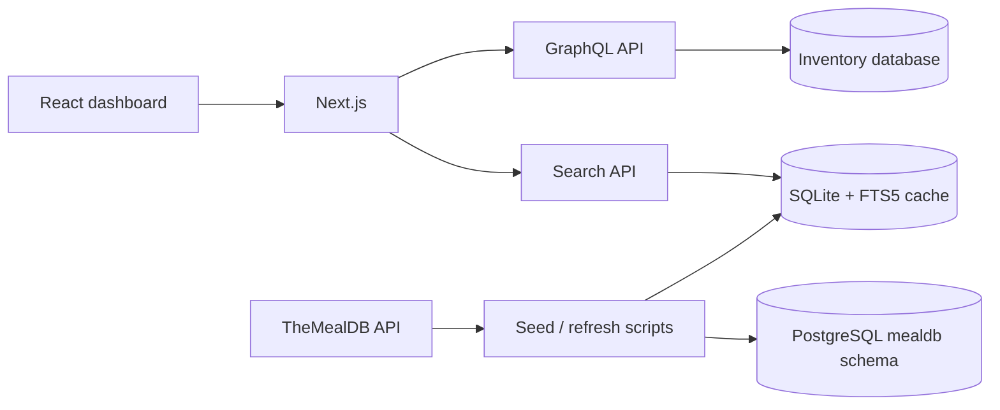

# Restaurant Inventory Management

Restaurant Inventory Management is a work-in-progress web application for organizing restaurant products, tracking stock, and making ingredient and meal data searchable. The project combines a Next.js dashboard with a GraphQL product API and a local SQLite search cache populated from [TheMealDB](https://www.themealdb.com/).

> **Development status:** This project is actively being built. The core dashboard, product CRUD flow, GraphQL API, search endpoint, local data seed, Docker setup, and Kubernetes manifests are present, but automated tests and some production workflows are still to be completed.

## What It Does

- Provides a landing page and an inventory dashboard.
- Supports product and category queries and mutations through GraphQL.
- Provides product forms for creating and editing inventory items.
- Searches ingredients, meals, and categories with SQLite FTS5.
- Seeds local SQLite data from TheMealDB.
- Can synchronize the cached meal and ingredient data to PostgreSQL.
- Includes Docker Compose services for the app, PostgreSQL, and pgAdmin.
- Includes Kubernetes manifests for an app deployment, PostgreSQL, pgAdmin, persistent storage, autoscaling, and scheduled cache refreshes.

## Technology

| Area | Technology |
| --- | --- |
| Frontend | React 19, Next.js 16 Pages Router |
| UI | Material UI, MUI X Data Grid, Emotion |
| Styling | Sass, Tailwind CSS, PostCSS |
| API | GraphQL, Apollo Server, Apollo Client |
| Local data and search | SQLite, `better-sqlite3`, SQLite FTS5 |
| Persistent relational data | PostgreSQL 16 |
| External data source | TheMealDB API |
| Tooling | ESLint 9, Next.js ESLint configuration |
| Deployment | Docker Compose and Kubernetes manifests |

## Application Flow

The product dashboard uses GraphQL for inventory operations. Search uses a separate read-oriented SQLite cache, which can be refreshed from TheMealDB and optionally copied to PostgreSQL for the containerized/Kubernetes deployment.



## Project Structure

```text
.
├── database/
│   ├── schema/                 PostgreSQL and inventory schema SQL
│   └── seeds/                  Seed data
├── data/                       Local SQLite database files (generated)
├── k8s/                        Kubernetes namespace, app, database, and job manifests
├── localStack/                 LocalStack notes and configuration
├── public/                     Static assets
├── scripts/
│   ├── seed-local.js           Populate data/inventory.db from TheMealDB
│   ├── setup-fts.js            Create or refresh SQLite FTS5 indexes
│   ├── init-cache.js           Initialize SQLite and PostgreSQL cache data
│   ├── refresh-cache.js        Refresh the cache for scheduled/container use
│   └── inspect-db.js           Inspect the local SQLite database
├── src/
│   ├── components/             Landing, layout, dashboard, forms, and tables
│   ├── graphql/
│   │   ├── client/             Apollo Client and client queries
│   │   └── server/             GraphQL schema and resolvers
│   ├── hooks/                  Inventory and filter hooks
│   ├── lib/                    SQLite connection and search helpers
│   ├── pages/                  Next.js pages and API routes
│   ├── styles/                 Global, layout, landing, and dashboard styles
│   ├── theme/                  Material UI theme
│   └── utility/                Database helpers and shared utilities
├── docker-compose.yml          Local app, PostgreSQL, and pgAdmin services
├── Dockerfile                  Container image definition
└── package.json                Scripts and dependencies
```

## Requirements

- Node.js `>=20.9.0`
- npm
- Internet access for the TheMealDB seed scripts
- PostgreSQL only when using the Docker or PostgreSQL synchronization workflow
- Docker Desktop only when running the full Compose stack

## Local Development

Install dependencies:

```bash
npm install
```

The application expects `data/inventory.db` to exist because the SQLite connection is opened in read/write mode with `fileMustExist: true`. On a new checkout, seed the local cache and create its search indexes:

```bash
node scripts/seed-local.js
node scripts/setup-fts.js
```

Start the development server:

```bash
npm run dev
```

Open [http://localhost:3000](http://localhost:3000). The primary routes are:

| Route | Purpose |
| --- | --- |
| `/` | Landing page |
| `/dashboard` | Inventory dashboard overview |
| `/dashboard/products` | Product inventory view |
| `/api/graphql` | GraphQL API |
| `/api/search?q=chicken` | Search and autocomplete API |
| `/api/health` | Health check |

## Docker Compose

Create a local `.env` file with the PostgreSQL connection values used by the app and cache scripts. The Compose database defaults are:

```dotenv
POSTGRES_HOST=postgres
POSTGRES_PORT=5432
POSTGRES_DB=mydb
POSTGRES_USER=postgres
POSTGRES_PASSWORD=postgres
```

Start the application, PostgreSQL, and pgAdmin:

```bash
docker compose up --build
```

Services are available at:

- App: [http://localhost:3000](http://localhost:3000)
- PostgreSQL from the host: `localhost:5433`
- pgAdmin: [http://localhost:5050](http://localhost:5050)

The Compose setup uses a persistent `postgres_data` volume. The default pgAdmin credentials are `admin@admin.com` and `admin`; change them before using this setup outside local development.

## Data and Cache Scripts

The local seed process fetches categories, meals, and meal details from TheMealDB and stores them in SQLite. The FTS5 setup must run after the seed process so search can query the generated indexes.

```bash
node scripts/seed-local.js
node scripts/setup-fts.js
node scripts/inspect-db.js
```

The container-oriented scripts use these PostgreSQL environment variables:

```dotenv
POSTGRES_HOST
POSTGRES_PORT       # defaults to 5432 in init-cache.js and refresh-cache.js
POSTGRES_DB
POSTGRES_USER
POSTGRES_PASSWORD
DB_SSL              # used by the PostgreSQL utility when set to true
```

See [scripts/README.md](scripts/README.md) for the TheMealDB data flow and [SQLite FTS5 reference](src/pages/api/search/SQLite_FTS5_Reference.md) for search implementation notes.

## GraphQL Operations

The GraphQL schema currently exposes:

- Queries: `products`, `product`, and `categories`
- Mutations: `createProduct`, `updateProduct`, `deleteProduct`, and `createCategory`
- Product fields such as quantity, unit, price, status, and calculated stock value

The API is implemented in [src/graphql/server/schema.js](src/graphql/server/schema.js), with resolvers in [src/graphql/server/resolver.js](src/graphql/server/resolver.js).

## Available Commands

| Command | Description |
| --- | --- |
| `npm run dev` | Start the Next.js development server |
| `npm run build` | Create a production build |
| `npm start` | Start the production server after building |
| `npm run lint` | Run ESLint across the repository |
| `npm test` | Placeholder command; automated tests are not implemented yet |

## Kubernetes

The `k8s/` directory contains deployment resources for a development or learning environment, including:

- Namespace and ConfigMap resources
- Node.js app deployment and service
- PostgreSQL deployment, service, volume, and claim
- pgAdmin deployment and service
- Horizontal Pod Autoscaler configuration
- Scheduled SQLite cache refresh job

Read [k8s/README.md](k8s/README.md) and the session notes in `k8s/` before applying manifests. Review secrets and storage settings for your target cluster first; the checked-in values are intended for development and demonstration.

## Current Limitations and Next Steps

- Automated unit, integration, and end-to-end tests are not in place yet.
- The project is still aligning its inventory product data model with the TheMealDB cache model.
- Environment validation and production secret management need further hardening.
- Deployment manifests should be reviewed and customized before production use.
- The search cache currently depends on a successful seed/index setup before the API can return useful results.

## Contributing

1. Create a feature branch.
2. Install dependencies and seed the local database.
3. Run `npm run lint` before opening a pull request.
4. Describe any schema, environment, or deployment changes in the pull request.

This repository is in active development, so small focused changes and clear setup notes are especially helpful.
