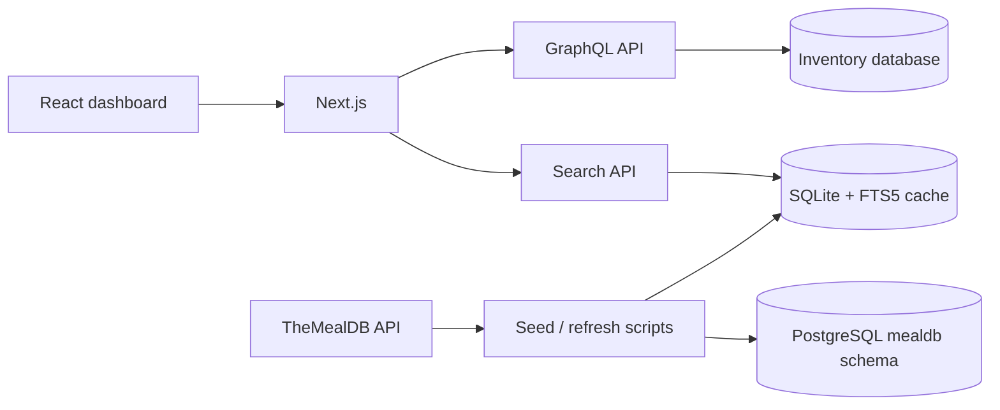
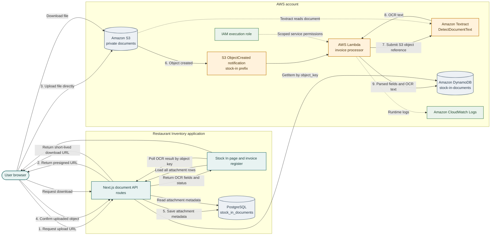

# Restaurant Inventory Management

Restaurant Inventory Management is a work-in-progress web application for organizing restaurant products, tracking stock, and making ingredient and meal data searchable. The project combines a Next.js dashboard with a GraphQL product API and a local SQLite search cache populated from [TheMealDB](https://www.themealdb.com/).

> **Development status:** This project is actively being built. The stock-in document workflow now supports direct S3 uploads, Lambda/Textract invoice extraction, DynamoDB OCR results, and an invoice register in the dashboard. AWS event wiring and account-specific deployment configuration remain environment prerequisites.

## What It Does

- Provides a landing page and an inventory dashboard.
- Supports product and category queries and mutations through GraphQL.
- Provides product forms for creating and editing inventory items.
- Searches ingredients, meals, and categories with SQLite FTS5.
- Seeds local SQLite data from TheMealDB.
- Can synchronize the cached meal and ingredient data to PostgreSQL.
- Includes Docker Compose services for the app, PostgreSQL, and pgAdmin.
- Includes Kubernetes manifests for an app deployment, PostgreSQL, pgAdmin, persistent storage, autoscaling, and scheduled cache refreshes.
- Uploads private stock-in documents to Amazon S3 and processes them with AWS Lambda and Amazon Textract.
- Displays extracted invoice number, PO reference, total due, and processing status from Amazon DynamoDB.

## Technology

| Area                       | Technology                              |
| -------------------------- | --------------------------------------- |
| Frontend                   | React 19, Next.js 16 Pages Router       |
| UI                         | Material UI, MUI X Data Grid, Emotion   |
| Styling                    | Sass, Tailwind CSS, PostCSS             |
| API                        | GraphQL, Apollo Server, Apollo Client   |
| Local data and search      | SQLite, `better-sqlite3`, SQLite FTS5   |
| Persistent relational data | PostgreSQL 16                           |
| Document storage           | Amazon S3                               |
| Invoice processing         | AWS Lambda and Amazon Textract          |
| OCR result storage         | Amazon DynamoDB                         |
| AWS operations             | IAM, CloudWatch Logs, AWS SAM           |
| External data source       | TheMealDB API                           |
| Tooling                    | ESLint 9, Next.js ESLint configuration  |
| Deployment                 | Docker Compose and Kubernetes manifests |

## Application Flow

The product dashboard uses GraphQL for inventory operations. Search uses a separate read-oriented SQLite cache, which can be refreshed from TheMealDB and optionally copied to PostgreSQL for the containerized/Kubernetes deployment.


```mermaid
flowchart LR
	Browser[React dashboard] --> Next[Next.js]
	Next --> GraphQL[GraphQL API]
	GraphQL --> Products[(Inventory database)]
	Next --> Search[Search API]
	Search --> SQLite[(SQLite + FTS5 cache)]
	MealDB[TheMealDB API] --> Seed[Seed / refresh scripts]
	Seed --> SQLite
	Seed --> PostgreSQL[(PostgreSQL mealdb schema)]
```

## AWS Architecture

The application coordinates document uploads and metadata while AWS services store, process, and return invoice data. Documents upload directly from the browser to Amazon S3; an S3 event invokes Lambda, which uses Textract and saves extracted invoice data to DynamoDB. The Next.js application reads that result for the Stock In invoice register.


```mermaid
architecture-beta
	group app(cloud)[Restaurant Inventory application]
	service browser(internet)[User browser]
	service next(server)[Next.js API and dashboard] in app
	service postgres(database)[PostgreSQL metadata] in app

	group aws(cloud)[AWS account]
	service s3(disk)[Amazon S3]
	service lambda(server)[AWS Lambda]
	service textract(cloud)[Amazon Textract]
	service dynamo(database)[Amazon DynamoDB]
	service cloudwatch(server)[CloudWatch Logs]

	browser:R --> L:next
	next:B --> T:postgres
	browser:R --> L:s3
	s3:R --> L:lambda
	lambda:R --> L:textract
	lambda:B --> T:dynamo
	next:R --> L:dynamo
	lambda:B --> T:cloudwatch
```

The diagram uses Mermaid's built-in architecture icons so it renders in GitHub without an external Iconify pack. The AWS services are represented by their built-in storage, compute, cloud, and database symbols and are labeled by service name. The browser uploads and downloads S3 objects directly using presigned URLs, and the S3 `ObjectCreated` notification triggers Lambda for objects under `stock-in/`.

## Project Structure

```text
.
├── database/
│   ├── schema/                 PostgreSQL and inventory schema SQL
│   └── seeds/                  Seed data
├── data/                       Local SQLite database files (generated)
├── k8s/                        Kubernetes namespace, app, database, and job manifests
├── localStack/                 LocalStack notes and configuration
├── public/                     Static assets
├── scripts/
│   ├── seed-local.js           Populate data/inventory.db from TheMealDB
│   ├── setup-fts.js            Create or refresh SQLite FTS5 indexes
│   ├── init-cache.js           Initialize SQLite and PostgreSQL cache data
│   ├── refresh-cache.js        Refresh the cache for scheduled/container use
│   └── inspect-db.js           Inspect the local SQLite database
├── src/
│   ├── components/             Landing, layout, dashboard, forms, and tables
│   ├── graphql/
│   │   ├── client/             Apollo Client and client queries
│   │   └── server/             GraphQL schema and resolvers
│   ├── hooks/                  Inventory and filter hooks
│   ├── lib/                    SQLite connection and search helpers
│   ├── pages/                  Next.js pages and API routes
│   ├── styles/                 Global, layout, landing, and dashboard styles
│   ├── theme/                  Material UI theme
│   └── utility/                Database helpers and shared utilities
├── docker-compose.yml          Local app, PostgreSQL, and pgAdmin services
├── Dockerfile                  Container image definition
└── package.json                Scripts and dependencies
```

## Requirements

- Node.js `>=20.9.0`
- npm
- Internet access for the TheMealDB seed scripts
- PostgreSQL only when using the Docker or PostgreSQL synchronization workflow
- Docker Desktop only when running the full Compose stack

## Local Development

Install dependencies:

```bash
npm install
```

The application expects `data/inventory.db` to exist because the SQLite connection is opened in read/write mode with `fileMustExist: true`. On a new checkout, seed the local cache and create its search indexes:

```bash
node scripts/seed-local.js
node scripts/setup-fts.js
```

Start the development server:

```bash
npm run dev
```

Open [http://localhost:3000](http://localhost:3000). The primary routes are:

| Route                   | Purpose                      |
| ----------------------- | ---------------------------- |
| `/`                     | Landing page                 |
| `/dashboard`            | Inventory dashboard overview |
| `/dashboard/products`   | Product inventory view       |
| `/dashboard/stock-in`   | Upload documents and review extracted invoice data |
| `/api/graphql`          | GraphQL API                  |
| `/api/search?q=chicken` | Search and autocomplete API  |
| `/api/health`           | Health check                 |

## Docker Compose

Create a local `.env` file with the PostgreSQL connection values used by the app and cache scripts. The Compose database defaults are:

```dotenv
POSTGRES_HOST=postgres
POSTGRES_PORT=5432
POSTGRES_DB=mydb
POSTGRES_USER=postgres
POSTGRES_PASSWORD=postgres
```

Start the application, PostgreSQL, and pgAdmin:

```bash
docker compose up --build
```

Services are available at:

- App: [http://localhost:3000](http://localhost:3000)
- PostgreSQL from the host: `localhost:5433`
- pgAdmin: [http://localhost:5050](http://localhost:5050)

The Compose setup uses a persistent `postgres_data` volume. The default pgAdmin credentials are `admin@admin.com` and `admin`; change them before using this setup outside local development.

## Stock-in Documents

The Stock In page at `/dashboard/stock-in` uploads supplier invoices and delivery receipts to a private S3 bucket. PostgreSQL stores the attachment metadata, while the AWS invoice processor extracts invoice fields and stores the OCR result in DynamoDB. The invoice register combines both records by their shared S3 object key and polls the OCR API while processing is pending.

### Architecture


```mermaid
flowchart LR
	browser([User browser])

	subgraph app[Restaurant Inventory application]
		ui[Stock In page and invoice register]
		api[Next.js document API routes]
		postgres[(PostgreSQL<br/>stock_in_documents)]
	end

	subgraph aws[AWS account]
		s3[(Amazon S3<br/>private documents)]
		event[S3 ObjectCreated notification<br/>stock-in prefix]
		lambda[AWS Lambda<br/>invoice processor]
		textract[Amazon Textract<br/>DetectDocumentText]
		dynamo[(Amazon DynamoDB<br/>stock-in-documents)]
		logs[Amazon CloudWatch Logs]
		role[IAM execution role]
	end

	browser -->|1. Request upload URL| api
	api -->|2. Return presigned URL| browser
	browser -->|3. Upload file directly| s3
	browser -->|4. Confirm uploaded object| api
	api -->|5. Save attachment metadata| postgres
	s3 -->|6. Object created| event
	event --> lambda
	lambda -->|7. Submit S3 object reference| textract
	s3 -.->|Textract reads document| textract
	textract -->|8. OCR text| lambda
	lambda -->|9. Parsed fields and OCR text| dynamo
	lambda -.->|Runtime logs| logs
	role -.->|Scoped service permissions| lambda
	ui -->|Load all attachment rows| api
	api -->|Read attachment metadata| postgres
	ui -->|Poll OCR result by object key| api
	api -->|GetItem by object_key| dynamo
	api -->|Return OCR fields and status| ui
	ui --> browser
	browser -->|Request download| api
	api -->|Return short-lived download URL| browser
	browser -->|Download file| s3

	classDef app fill:#e8f3f2,stroke:#236b68,color:#173b39,stroke-width:1.5px
	classDef aws fill:#fff2dc,stroke:#bd7200,color:#49320c,stroke-width:1.5px
	classDef data fill:#edf1f5,stroke:#586b7c,color:#263746,stroke-width:1.5px
	classDef ops fill:#eaf3ec,stroke:#438050,color:#1e4629,stroke-width:1.5px
	class ui,api app
	class browser app
	class postgres data
	class s3,dynamo data
	class event,lambda,textract aws
	class logs,role ops
```

### Processing Steps

1. The browser requests a short-lived S3 upload URL from `/api/documents/presign`, uploads the file directly to S3, then calls `/api/documents/complete`.
2. The completion route verifies the S3 object and records its key, filename, stock-in reference, content type, size, and upload time in PostgreSQL.
3. An S3 `ObjectCreated` notification for the `stock-in/` prefix invokes the Lambda processor.
4. Lambda calls Textract `DetectDocumentText`, extracts invoice number, PO reference, and total due from the recognized lines, and writes the fields, extracted text, status, and processing time to DynamoDB.
5. The invoice register loads attachment metadata from PostgreSQL and reads OCR results from DynamoDB through `/api/documents/ocr/<object-key>`. Pending results are polled until processing finishes.
6. Downloads use a short-lived S3 URL returned by the document download API.

The S3 notification is configured on the bucket separately; it is not declared by the current SAM template. The template defines the Lambda function and DynamoDB table. The Next.js API routes are not fronted by API Gateway in this design.

### AWS Services

| Service | Role in the workflow |
| ------- | -------------------- |
| Amazon S3 | Private document storage and presigned upload/download targets |
| Amazon S3 Event Notifications | Invokes the processor for newly created objects under `stock-in/` |
| AWS Lambda | Coordinates OCR, extracts fields, and persists processing results |
| Amazon Textract | Runs `DetectDocumentText` on the S3 document |
| Amazon DynamoDB | Stores OCR text, extracted fields, status, and processing time, keyed by `object_key` |
| AWS IAM | Grants the Lambda role access to S3, Textract, DynamoDB, and logging |
| Amazon CloudWatch Logs | Captures Lambda runtime logs |
| AWS SAM / CloudFormation | Deploys the Lambda and DynamoDB resources defined in `lambda-service/template.yml` |

### Configure the Application

Initialize the PostgreSQL schema and seed local inventory data:

```bash
make db-init
make db-seed
```

Use `make db-reset` when you intentionally want to drop and recreate the local database objects.

For local development, start LocalStack with Compose. The startup script initializes the configured bucket:

```bash
docker compose up -d localstack
```

The S3 settings used locally are:

```dotenv
AWS_REGION=us-east-1
AWS_ACCESS_KEY_ID=test
AWS_SECRET_ACCESS_KEY=test
S3_BUCKET_NAME=restaurant-inventory-documents
S3_ENDPOINT=http://localhost:4566
S3_PUBLIC_ENDPOINT=http://localhost:4566
DOCUMENTS_TABLE=stock-in-documents
```

The active Compose configuration emulates S3 and runs PostgreSQL; it does not run the Lambda/Textract/DynamoDB OCR pipeline. OCR processing and lookup require the AWS resources and permissions described above. For AWS, use `.env.aws.example`, omit S3 endpoint overrides, use the SDK credential chain or an IAM role instead of LocalStack test credentials, and keep the bucket private. Add application authentication and authorization checks to the document API before exposing this workflow to multiple restaurant users.

## Data and Cache Scripts

The local seed process fetches categories, meals, and meal details from TheMealDB and stores them in SQLite. The FTS5 setup must run after the seed process so search can query the generated indexes.

```bash
node scripts/seed-local.js
node scripts/setup-fts.js
node scripts/inspect-db.js
```

The container-oriented scripts use these PostgreSQL environment variables:

```dotenv
POSTGRES_HOST
POSTGRES_PORT       # defaults to 5432 in init-cache.js and refresh-cache.js
POSTGRES_DB
POSTGRES_USER
POSTGRES_PASSWORD
DB_SSL              # used by the PostgreSQL utility when set to true
```

See [scripts/README.md](scripts/README.md) for the TheMealDB data flow and [SQLite FTS5 reference](src/pages/api/search/SQLite_FTS5_Reference.md) for search implementation notes.

## GraphQL Operations

The GraphQL schema currently exposes:

- Queries: `products`, `product`, and `categories`
- Mutations: `createProduct`, `updateProduct`, `deleteProduct`, and `createCategory`
- Product fields such as quantity, unit, price, status, and calculated stock value

The API is implemented in [src/graphql/server/schema.js](src/graphql/server/schema.js), with resolvers in [src/graphql/server/resolver.js](src/graphql/server/resolver.js).

## Available Commands

| Command         | Description                                                  |
| --------------- | ------------------------------------------------------------ |
| `npm run dev`   | Start the Next.js development server                         |
| `npm run build` | Create a production build                                    |
| `npm start`     | Start the production server after building                   |
| `npm run lint`  | Run ESLint across the repository                             |
| `npm test`      | Placeholder command; automated tests are not implemented yet |

## Kubernetes

The `k8s/` directory contains deployment resources for a development or learning environment, including:

- Namespace and ConfigMap resources
- Node.js app deployment and service
- PostgreSQL deployment, service, volume, and claim
- pgAdmin deployment and service
- Horizontal Pod Autoscaler configuration
- Scheduled SQLite cache refresh job

Read [k8s/README.md](k8s/README.md) and the session notes in `k8s/` before applying manifests. Review secrets and storage settings for your target cluster first; the checked-in values are intended for development and demonstration.

## Current Limitations and Next Steps

- Automated unit, integration, and end-to-end tests are not in place yet.
- The project is still aligning its inventory product data model with the TheMealDB cache model.
- Environment validation and production secret management need further hardening.
- Deployment manifests should be reviewed and customized before production use.
- The search cache currently depends on a successful seed/index setup before the API can return useful results.

## Contributing

1. Create a feature branch.
2. Install dependencies and seed the local database.
3. Run `npm run lint` before opening a pull request.
4. Describe any schema, environment, or deployment changes in the pull request.

This repository is in active development, so small focused changes and clear setup notes are especially helpful.
