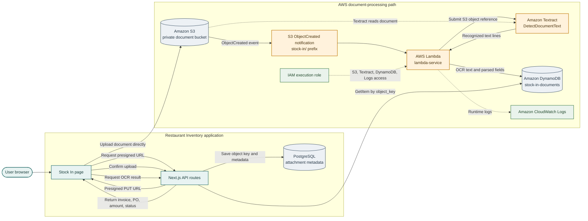

# Invoice Processor Lambda

The invoice processor is an AWS Lambda function invoked by an Amazon S3 object-created notification. It sends the stored document to Amazon Textract, extracts common invoice fields from the OCR lines, and writes the result to Amazon DynamoDB. The Next.js application reads the result through its OCR API and displays it in the Stock In invoice register.

## Architecture



S3, Lambda, Textract, DynamoDB, IAM, and CloudWatch Logs are the AWS services used by the processing path. PostgreSQL stores the application's document metadata; DynamoDB stores OCR output. They share the S3 `object_key` as the lookup value.

## Processing Behavior

For each S3 record in the event, `invoice-processor/app.py`:

1. Decodes the S3 object key from the event record.
2. Calls Textract `DetectDocumentText` with the bucket and object key.
3. Joins the Textract `LINE` blocks into extracted text.
4. Parses `invoice_number`, `po_reference`, and `total_due` from that text.
5. Writes an item to DynamoDB with `object_key` as the partition key, plus the bucket, full extracted text, parsed fields, `processed` status, processing time, and Textract operation name.

The Next.js OCR route reads DynamoDB by `object_key`. If processing has not written an item yet, the route returns a pending response; the Stock In page polls until it receives a terminal result.

## AWS Resources and Deployment

The SAM template is [`template.yml`](template.yml). It defines:

- Lambda function `lambda-service` using Python 3.12.
- DynamoDB table `stock-in-documents`, on-demand billing, partition key `object_key`.
- Lambda permissions for reading the configured S3 bucket, calling Textract, writing DynamoDB, and emitting runtime logs.

The S3 bucket is managed outside this SAM template. Configure an S3 `ObjectCreated` event notification for the `stock-in/` prefix and grant S3 permission to invoke the Lambda. The event notification is a required integration step; it is not created by `template.yml`. There is no API Gateway in this flow; browser-facing endpoints are Next.js API routes.

The GitHub Actions workflow at `.github/workflows/lambda-service-cd.yml` is configured to use GitHub OIDC and AWS SAM when changes to `lambda-service/**` are pushed to `main`. Deployment requires the `AWS_ROLE_ARN` and `AWS_REGION` repository secrets and an AWS role with the required deployment permissions. A workflow definition does not itself confirm that the AWS stack or S3 notification is currently deployed and enabled.

## Local Development and Tests

The main Docker Compose configuration runs LocalStack with **S3 only**, plus the application and PostgreSQL. It does not locally execute this Lambda or emulate Textract and DynamoDB. Use an AWS account with the required resources for live OCR processing; LocalStack uploads alone do not produce OCR results.

The unit tests mock AWS clients and can run without calling AWS. From the repository root:

```bash
cd lambda-service
PYTHONPATH=invoice-processor pytest invoice-processor/tests
```

The sample S3 event is in [`events/s3-event.json`](events/s3-event.json). For a live AWS smoke test and DynamoDB verification, see [`invoice-processor/how-to-test-invoice-flow.md`](invoice-processor/how-to-test-invoice-flow.md).

## Configuration

| Variable | Used by | Purpose |
| -------- | ------- | ------- |
| `AWS_REGION` | Next.js and Lambda SDKs | AWS region; the Next.js OCR route defaults to `us-east-1` |
| `S3_BUCKET_NAME` | Next.js application | Bucket used for presigned uploads and downloads |
| `DOCUMENTS_TABLE` | Next.js OCR route and Lambda | DynamoDB table name; defaults to `stock-in-documents` |
| `S3_ENDPOINT` | Next.js server, local only | LocalStack endpoint for server-side S3 calls |
| `S3_PUBLIC_ENDPOINT` | Browser-facing presigned URLs, local only | LocalStack endpoint reachable from the browser |

For local S3 credentials, use the dummy credentials from `.env.localstack.example` only with LocalStack. For AWS, use an IAM role or the AWS SDK credential chain; do not send LocalStack credentials to AWS. Example application settings are in [`.env.aws.example`](../.env.aws.example) and [`.env.localstack.example`](../.env.localstack.example).

## Project Layout

```text
lambda-service/
├── events/
│   └── s3-event.json
├── invoice-processor/
│   ├── app.py
│   ├── requirements.txt
│   ├── how-to-test-invoice-flow.md
│   ├── invoice-processing-pipeline.md
│   └── tests/
│       └── test_app.py
├── template.yml
└── README.md
```